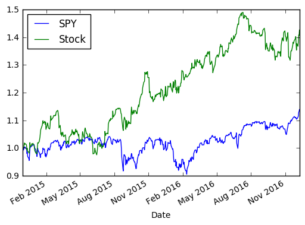
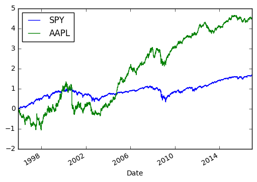

Hello World!


```python
%matplotlib inline
```


```python
from pandas_datareader import data
```


```python
import datetime as dt
```


```python
from math import sqrt
```


```python
from numpy import log, exp
```


```python
import pandas as pd
```


```python
start = dt.datetime(2014,11,28)
```


```python
end = dt.datetime(2016,12,9)
```


```python
spy = data.DataReader('SPY','yahoo',start,end)['Adj Close']
```


```python
p = data.DataReader('MO','yahoo',start,end)['Adj Close']
```


```python
df = pd.DataFrame({'SPY':spy,'Stock':p})
```


```python
df /= df.iloc[0]
```


```python
df.plot();
```





```python
r = df.pct_change().dropna()
```


```python
r.std()
```


    SPY      0.009431
    Stock    0.009902
    dtype: float64


```python
df.iloc[-1]
```


    SPY      2.149857
    Stock    3.633068
    Name: 2016-12-09 00:00:00, dtype: float64


```python
n = df.count()
```


```python
(((df.iloc[-1]**(1/n))**252) - 1)/(r.std()*sqrt(252))
```


    SPY      0.903749
    Stock    1.517135
    dtype: float64


```python
KO = data.DataReader('KO','yahoo',start,end)
```


```python
p['KO'] = KO['Adj Close']
```


```python
p['KO'] /= p['KO'].iloc[0]
```


```python
p['KO'] = log(p['KO'])
```


```python
p[['SPY','AAPL']].plot();
```





```python
p.head()
```


<div>
<table border="1" class="dataframe">
  <thead>
    <tr style="text-align: right;">
      <th></th>
      <th>E</th>
      <th>XOM</th>
      <th>COP</th>
      <th>SPY</th>
      <th>KO</th>
    </tr>
    <tr>
      <th>Date</th>
      <th></th>
      <th></th>
      <th></th>
      <th></th>
      <th></th>
    </tr>
  </thead>
  <tbody>
    <tr>
      <th>1995-12-01</th>
      <td>0.000000</td>
      <td>0.000000</td>
      <td>0.000000</td>
      <td>0.000000</td>
      <td>0.000000</td>
    </tr>
    <tr>
      <th>1995-12-04</th>
      <td>-0.022007</td>
      <td>0.011191</td>
      <td>-0.007326</td>
      <td>0.012223</td>
      <td>0.006167</td>
    </tr>
    <tr>
      <th>1995-12-05</th>
      <td>0.000000</td>
      <td>0.025398</td>
      <td>-0.007326</td>
      <td>0.018783</td>
      <td>0.020814</td>
    </tr>
    <tr>
      <th>1995-12-06</th>
      <td>0.005108</td>
      <td>0.034759</td>
      <td>-0.011009</td>
      <td>0.021043</td>
      <td>0.046333</td>
    </tr>
    <tr>
      <th>1995-12-07</th>
      <td>0.005108</td>
      <td>0.038053</td>
      <td>-0.018417</td>
      <td>0.015761</td>
      <td>0.033655</td>
    </tr>
  </tbody>
</table>
</div>


```python
exp(p).iloc[-1]
```


    E      6.718162
    XOM    7.757184
    COP    7.575459
    SPY    5.414596
    KO     3.585011
    Name: 2016-12-09 00:00:00, dtype: float64


```python
AAPL = data.DataReader('AAPL','yahoo',start,end)
```


```python
p['AAPL'] = AAPL['Adj Close']
```


```python
p['AAPL'] /= p['AAPL'].iloc[0]
```


```python
p['AAPL'] = log(p['AAPL'])
```


```python

```
